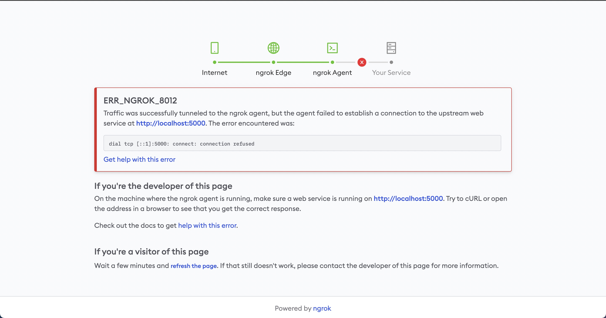

## 初期設定
```
python3 -m venv venv
source venv/vin/activate
pip3 install -r requirement.txt
```

## サーバを起動する
```
source venv/bin/activate
python3 app.py
```

## 外部公開する
```
ngrok http http://localhost:5000
```

## ライブラリを追加した時のコマンド
```
pip3 freeze > requirement.txt
```


## トラブルシューティング


アプリが起動していない場合、以下のようなエラーとなる。ラズパイでappを起動できているか確認する



